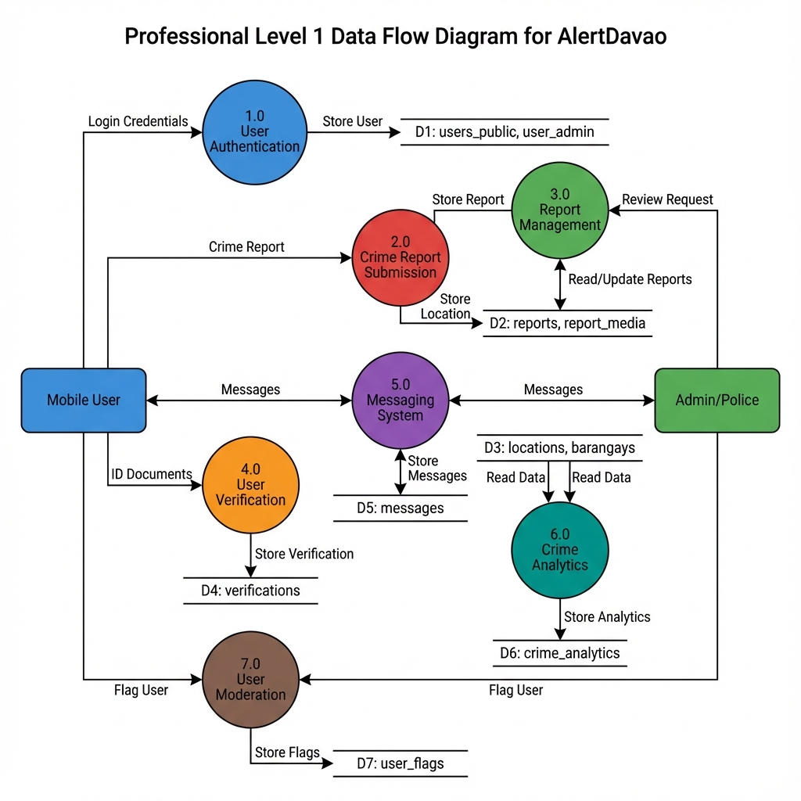
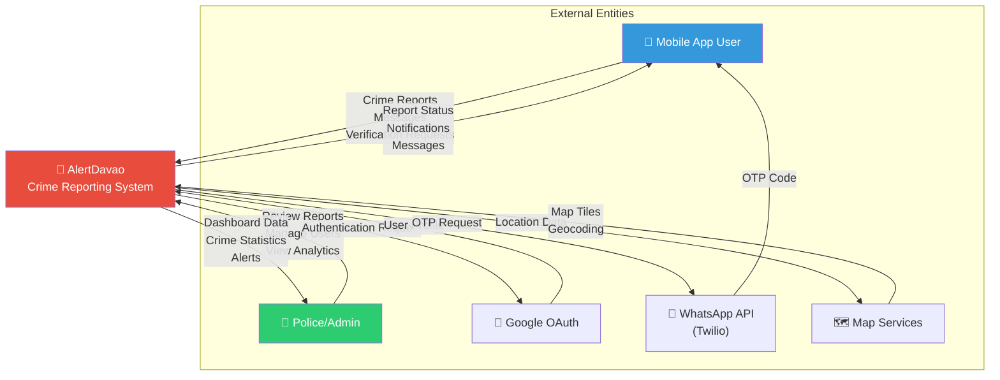
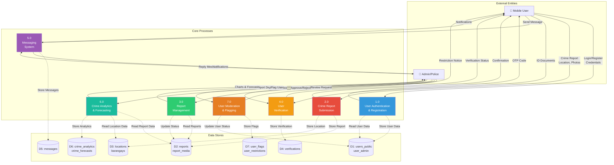
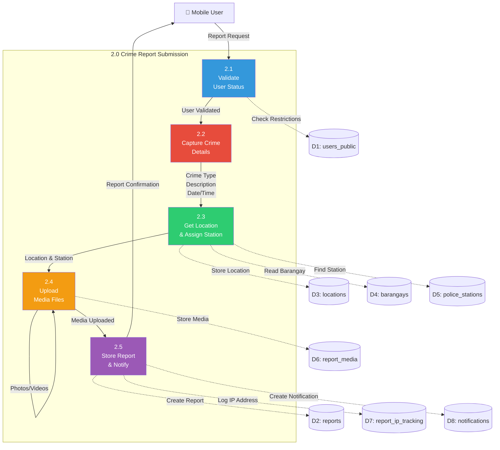

# AlertDavao Data Flow Diagram (DFD)

**System:** AlertDavao Crime Reporting Platform  
**Generated:** 2025-12-18

---

## Visual Diagrams

### Context Diagram (Level 0)


### Level 1 DFD - Main Processes



---

## Context Diagram (Level 0) - Mermaid



---

## Level 1 DFD - Main Processes



---

## Level 2 DFD - Crime Report Submission (Process 2.0)



---

## Level 2 DFD - Report Management (Process 3.0)

```mermaid
graph TB
    Admin["👮 Admin/Police"]
    
    subgraph ReportMgmt["3.0 Report Management"]
        P31["3.1<br/>View Reports<br/>Dashboard"]
        P32["3.2<br/>Review Report<br/>Details"]
        P33["3.3<br/>Update Report<br/>Status"]
        P34["3.4<br/>Reassign<br/>Station"]
        P35["3.5<br/>Mark Validity<br/>& Notify User"]
    end
    
    D1[("D2: reports")]
    D2[("D3: locations")]
    D3[("D4: report_media")]
    D4[("D5: police_stations")]
    D5[("D6: report_reassignment_requests")]
    D6[("D8: notifications")]
    
    User["👤 Mobile User"]
    
    Admin -->|View Reports| P31
    P31 -.->|Read Reports| D1
    P31 -.->|Read Locations| D2
    P31 -->|Report List| Admin
    
    Admin -->|Select Report| P32
    P32 -.->|Read Report Details| D1
    P32 -.->|Read Media| D3
    P32 -->|Full Report| Admin
    
    Admin -->|Update Status<br/>(Pending/Investigating/Resolved)| P33
    P33 -.->|Update Report| D1
    P33 -->|Status Updated| P35
    
    Admin -->|Request Reassignment| P34
    P34 -.->|Create Request| D5
    P34 -.->|Update Station| D1
    P34 -.->|Read Stations| D4
    P34 -->|Reassigned| P35
    
    P35 -.->|Create Notification| D6
    P35 -->|Status Update| User
    
    style P31 fill:#3498db,color:#fff
    style P32 fill:#2ecc71,color:#fff
    style P33 fill:#f39c12,color:#fff
    style P34 fill:#9b59b6,color:#fff
    style P35 fill:#e74c3c,color:#fff
```

---

## Data Flow Summary

### Key Data Flows

1. **User Registration Flow**
   - User → Authentication → OTP Verification → User Database

2. **Crime Report Flow**
   - User → Report Submission → Location Assignment → Station Assignment → Database Storage → Admin Notification

3. **Report Review Flow**
   - Admin → View Reports → Review Details → Update Status → User Notification

4. **Verification Flow**
   - User → Upload Documents → Encryption → Admin Review → Approval/Rejection → User Notification

5. **Messaging Flow**
   - User/Admin → Message Composition → Database Storage → Recipient Notification

6. **Analytics Flow**
   - Report Data → Aggregation → Statistical Analysis → SARIMA Forecasting → Dashboard Display

7. **Moderation Flow**
   - Admin → Flag User → Restriction Application → User Database Update → User Notification

---

## External Integrations

| Service | Purpose | Data Flow |
|---------|---------|-----------|
| **Google OAuth** | User authentication | Bidirectional (auth request/profile) |
| **Twilio WhatsApp** | OTP delivery | Outbound (OTP codes) |
| **Leaflet Maps** | Crime mapping | Inbound (map tiles, geocoding) |
| **Node.js Backend** | File storage | Bidirectional (media upload/retrieval) |
| **PostgreSQL** | Data persistence | Bidirectional (CRUD operations) |
| **SARIMA API** | Crime forecasting | Bidirectional (historical data/predictions) |
