# AlertDavao Data Flow Diagram (DFD) - Simplified

**System:** AlertDavao Crime Reporting Platform  
**Database:** alertdavao_w07v (PostgreSQL - Latest as of 2025-12-18)  
**Generated:** 2025-12-18

---

## Visual Diagrams

### Context Diagram (Level 0) - Simplified

*This diagram shows the AlertDavao system and its interactions with external entities.*

---

## Level 1 DFD - Main Processes (Simplified)

```mermaid
graph LR
    subgraph Users["👥 Users"]
        MU["📱 Mobile User"]
        PA["👮 Police/Admin"]
    end
    
    subgraph Core["🚨 AlertDavao Core Processes"]
        P1["1️⃣ Login &<br/>Register"]
        P2["2️⃣ Submit<br/>Crime Report"]
        P3["3️⃣ Get<br/>Verified"]
        P4["4️⃣ Review<br/>Reports"]
        P5["5️⃣ Chat<br/>System"]
        P6["6️⃣ View<br/>Analytics"]
    end
    
    subgraph Data["💾 Database"]
        D1[("Users")]
        D2[("Reports")]
        D3[("Locations")]
    end
    
    MU -->|Login| P1
    P1 -.->|Store| D1
    
    MU -->|Submit Report| P2
    P2 -.->|Save| D2
    P2 -.->|Save Location| D3
    
    MU -->|Upload ID| P3
    
    PA -->|Review| P4
    P4 -.->|Read/Update| D2
    
    MU <-->|Messages| P5
    PA <-->|Messages| P5
    P5 -.->|Store| D2
    
    PA -->|View Stats| P6
    P6 -.->|Read| D2
    P6 -.->|Read| D3
    
    style P1 fill:#3498db,color:#fff
    style P2 fill:#e74c3c,color:#fff
    style P3 fill:#f39c12,color:#fff
    style P4 fill:#2ecc71,color:#fff
    style P5 fill:#9b59b6,color:#fff
    style P6 fill:#1abc9c,color:#fff
```

**Key Processes:**
1. **Login & Register** - User authentication with OTP
2. **Submit Crime Report** - Report crimes with location and photos
3. **Get Verified** - Upload ID documents for verification
4. **Review Reports** - Police review and update report status
5. **Chat System** - Communication between users and police
6. **View Analytics** - Crime statistics and forecasting

---

## Crime Report Submission Flow (Step-by-Step)

```mermaid
graph LR
    User["📱 User"] --> S1["1. Select<br/>Crime Type"]
    S1 --> S2["2. Add Details<br/>& Photos"]
    S2 --> S3["3. Pick Location<br/>on Map"]
    S3 --> S4["4. Auto-Assign<br/>Police Station"]
    S4 --> S5["5. Submit<br/>Report"]
    S5 --> DB[("💾 Database")]
    S5 --> Police["👮 Police<br/>Dashboard"]
    
    style S1 fill:#e3f2fd,color:#000
    style S2 fill:#bbdefb,color:#000
    style S3 fill:#90caf9,color:#000
    style S4 fill:#64b5f6,color:#fff
    style S5 fill:#42a5f5,color:#fff
    style Police fill:#2ecc71,color:#fff
```

**Report Submission Steps:**
1. **Select Crime Type** - Choose from categories (Theft, Assault, etc.)
2. **Add Details & Photos** - Describe incident and upload evidence
3. **Pick Location on Map** - Mark exact location where crime occurred
4. **Auto-Assign Police Station** - System assigns based on barangay
5. **Submit Report** - Report saved and police are notified

---

## Report Review Flow (Police Side)

```mermaid
graph LR
    Police["👮 Police"] --> V1["1. View<br/>Reports List"]
    V1 --> V2["2. Open<br/>Report Details"]
    V2 --> V3["3. Review<br/>Evidence"]
    V3 --> V4{"4. Update<br/>Status"}
    V4 -->|Investigating| N1["Notify User"]
    V4 -->|Resolved| N1
    V4 -->|Invalid| N1
    N1 --> User["📱 User Gets<br/>Notification"]
    
    style V1 fill:#c8e6c9,color:#000
    style V2 fill:#a5d6a7,color:#000
    style V3 fill:#81c784,color:#000
    style V4 fill:#66bb6a,color:#fff
    style N1 fill:#4caf50,color:#fff
```

**Review Process:**
1. **View Reports List** - See all pending reports
2. **Open Report Details** - View full information, photos, location
3. **Review Evidence** - Assess validity and severity
4. **Update Status** - Mark as investigating, resolved, or invalid
5. **Notify User** - User receives status update notification

---

## User Verification Flow

```mermaid
graph LR
    User["📱 User"] --> U1["1. Upload<br/>ID Photo"]
    U1 --> U2["2. Upload<br/>Selfie with ID"]
    U2 --> U3["3. Upload<br/>Billing Document"]
    U3 --> DB[("💾 Encrypted<br/>Storage")]
    DB --> Admin["👮 Admin<br/>Reviews"]
    Admin --> D{"Decision"}
    D -->|Approve| A1["✅ User<br/>Verified"]
    D -->|Reject| A2["❌ Request<br/>More Info"]
    A1 --> User
    A2 --> User
    
    style U1 fill:#fff3e0,color:#000
    style U2 fill:#ffe0b2,color:#000
    style U3 fill:#ffcc80,color:#000
    style A1 fill:#4caf50,color:#fff
    style A2 fill:#f44336,color:#fff
```

**Verification Steps:**
1. **Upload ID Photo** - Government-issued ID
2. **Upload Selfie with ID** - Proof of identity
3. **Upload Billing Document** - Proof of address
4. **Admin Reviews** - Manual verification by police/admin
5. **Decision** - Approve or request additional information

---

## Data Stores

| Store | Tables | Purpose |
|-------|--------|---------|
| **D1: Users** | `users_public`, `user_admin` | User accounts and profiles |
| **D2: Reports** | `reports`, `report_media`, `messages` | Crime reports and communications |
| **D3: Locations** | `locations`, `barangays`, `police_stations` | Geographic data and station assignments |

---

## External Services

| Service | Purpose | Integration |
|---------|---------|-------------|
| **Google OAuth** | User authentication | Login/Register |
| **WhatsApp (Twilio)** | OTP delivery | Phone verification |
| **Leaflet Maps** | Crime mapping | Location selection |
| **PostgreSQL** | Data storage | All data persistence |
| **SARIMA API** | Crime forecasting | Analytics dashboard |

---

## Key Features

✅ **Real-time Notifications** - Users get instant updates on report status  
✅ **Automatic Station Assignment** - Based on barangay boundaries  
✅ **Encrypted Document Storage** - Secure ID verification  
✅ **IP Tracking** - Prevent spam and abuse  
✅ **User Moderation** - Flag and restrict problematic users  
✅ **Crime Analytics** - Statistical analysis and forecasting  
✅ **Mobile-First Design** - React Native app for users  
✅ **Admin Dashboard** - Laravel-based management system
