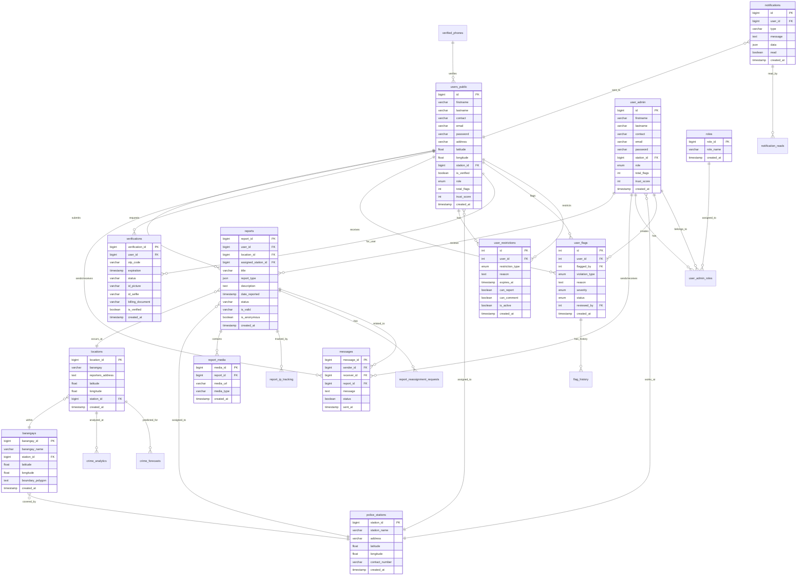

# AlertDavao Entity Relationship Diagram (ERD)

**Database:** alertdavao_f2ij (PostgreSQL)  
**Generated:** 2025-12-18

---

## Visual ERD Diagram

---

## Entity Relationship Diagram (Mermaid)

---

## Key Relationships

### User Management
- **users_public** and **user_admin** are separate user types (mobile app users vs admin/police)
- Both can send/receive **messages** and are linked to **police_stations**
- **users_public** can submit **reports** and request **verifications**

### Report System
- **reports** are created by **users_public**
- Each report has a **location** (with coordinates)
- Reports are assigned to **police_stations** for investigation
- Reports can have multiple **report_media** (photos/videos)
- **report_ip_tracking** monitors submission metadata

### Geographic Hierarchy
- **locations** → **barangays** → **police_stations**
- Each barangay is covered by a police station
- Crime analytics and forecasts are tied to locations

### Moderation System
- **user_flags** track violations by users
- **user_restrictions** enforce penalties (can_report, can_comment, etc.)
- **flag_history** maintains audit trail

### Verification System
- **verifications** store encrypted ID documents
- **verified_phones** track phone number verification
- Links to **users_public** for identity confirmation

---

## Database Statistics

| Entity | Row Count | Purpose |
|--------|-----------|---------|
| locations | 18,543 | Crime incident coordinates |
| barangays | 233 | Davao City administrative divisions |
| police_stations | 21 | Police station coverage areas |
| reports | 15 | Active crime reports |
| user_admin | 10 | Admin and police accounts |
| users_public | 4 | Mobile app users |
| messages | 13 | User-admin communications |
| verifications | 2 | Pending ID verifications |
