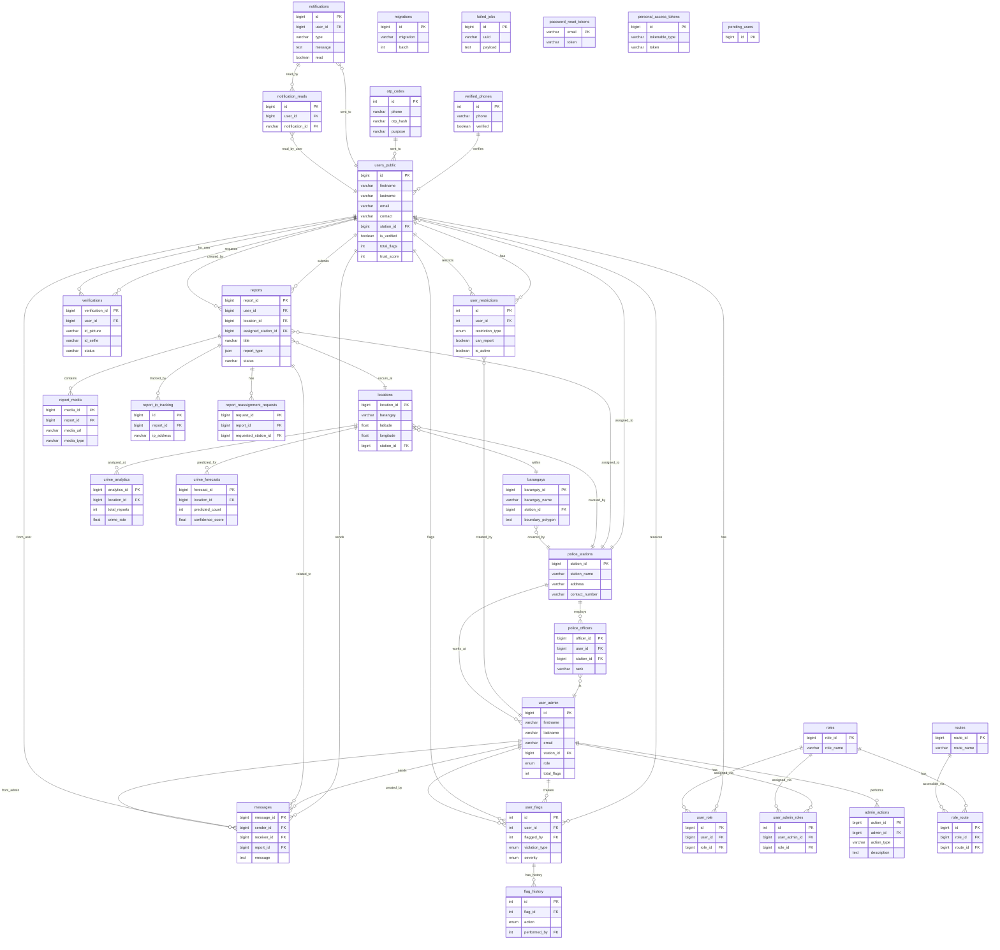

# AlertDavao Complete Entity Relationship Diagram (ERD)

**Database:** alertdavao_f2ij (PostgreSQL)  
**Generated:** 2025-12-18  
**Total Tables:** 32 (All Included)

---

## Complete Visual ERD - All 32 Tables


*This diagram shows all 32 tables organized by functional area with relationships.*

---

## Table Organization by Category

### 👥 User Management (5 tables)
1. **users_public** - Mobile app users (4 rows)
2. **user_admin** - Admin/police users (10 rows)
3. **roles** - User roles (6 rows)
4. **user_admin_roles** - Admin role assignments (3 rows)
5. **user_role** - User role assignments (0 rows - unused)

### 📋 Reports System (4 tables)
6. **reports** - Crime reports (15 rows)
7. **report_media** - Report photos/videos (12 rows)
8. **report_ip_tracking** - Spam prevention (15 rows)
9. **report_reassignment_requests** - Station transfers (0 rows)

### 🗺️ Location & Geography (4 tables)
10. **locations** - Crime locations (18,543 rows)
11. **barangays** - Geographic divisions (233 rows)
12. **police_stations** - Police station data (21 rows)
13. **police_officers** - Officer assignments (0 rows - unused)

### ✅ Verification System (3 tables)
14. **verifications** - ID verification requests (2 rows)
15. **verified_phones** - Phone verification (4 rows)
16. **otp_codes** - OTP codes (22 rows)

### 💬 Communication (3 tables)
17. **messages** - User-admin chat (13 rows)
18. **notifications** - User notifications (10 rows)
19. **notification_reads** - Read status tracking (23 rows)

### 🚫 User Moderation (3 tables)
20. **user_flags** - User violations (29 rows)
21. **user_restrictions** - User penalties (10 rows)
22. **flag_history** - Flag audit trail (0 rows)

### 📊 Analytics (2 tables)
23. **crime_analytics** - Crime statistics (0 rows)
24. **crime_forecasts** - SARIMA predictions (0 rows)

### ⚙️ Laravel System (5 tables)
25. **migrations** - Database version control (56 rows)
26. **failed_jobs** - Queue failures (0 rows)
27. **password_reset_tokens** - Password resets (0 rows)
28. **personal_access_tokens** - API tokens (0 rows)
29. **pending_users** - Registration queue (0 rows)

### 🔐 Permissions (3 tables)
30. **routes** - Route definitions (0 rows - unused)
31. **role_route** - Role-route mapping (0 rows - unused)
32. **admin_actions** - Admin audit trail (0 rows - unused)

---

## Complete ERD with All Relationships (Mermaid)



---

## Summary Statistics

| Category | Tables | Active Tables | Total Rows |
|----------|--------|---------------|------------|
| User Management | 5 | 4 | 23 |
| Reports System | 4 | 3 | 42 |
| Location & Geography | 4 | 3 | 18,797 |
| Verification System | 3 | 3 | 28 |
| Communication | 3 | 3 | 46 |
| User Moderation | 3 | 2 | 39 |
| Analytics | 2 | 0 | 0 |
| Laravel System | 5 | 1 | 56 |
| Permissions | 3 | 0 | 0 |
| **TOTAL** | **32** | **22** | **19,031** |

---

## Unused Tables (0 rows)

These 10 tables exist but are currently unused:

1. **user_role** - Replaced by user_admin_roles
2. **police_officers** - Officers tracked via user_admin
3. **report_reassignment_requests** - Feature not implemented
4. **flag_history** - Audit trail not being used
5. **crime_analytics** - Analytics not yet generated
6. **crime_forecasts** - SARIMA forecasting not yet active
7. **failed_jobs** - No queue failures
8. **password_reset_tokens** - No password resets yet
9. **personal_access_tokens** - No API tokens issued
10. **pending_users** - Registration queue not used
11. **routes** - Route-based permissions not implemented
12. **role_route** - Route-based permissions not implemented
13. **admin_actions** - Admin audit trail not being used

**Recommendation:** Consider removing unused tables or implementing their intended features.

---

## Key Relationships Summary

### Core Data Flow
```
users_public → reports → locations → barangays → police_stations
```

### Verification Flow
```
users_public → verifications (ID documents)
users_public → verified_phones (phone verification)
```

### Communication Flow
```
users_public ↔ messages ↔ user_admin
users_public ← notifications
```

### Moderation Flow
```
user_admin → user_flags → users_public
user_admin → user_restrictions → users_public
```

---

## Database Health

✅ **Active Tables:** 22/32 (69%)  
⚠️ **Unused Tables:** 10/32 (31%)  
📊 **Total Records:** 19,031  
🗺️ **Largest Table:** locations (18,543 rows - 97% of data)
